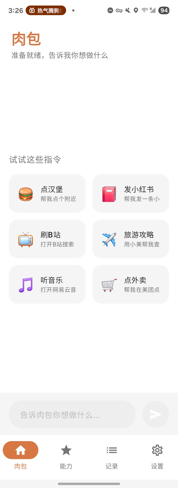
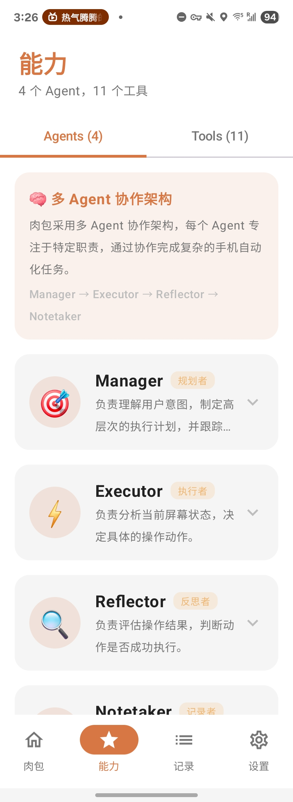
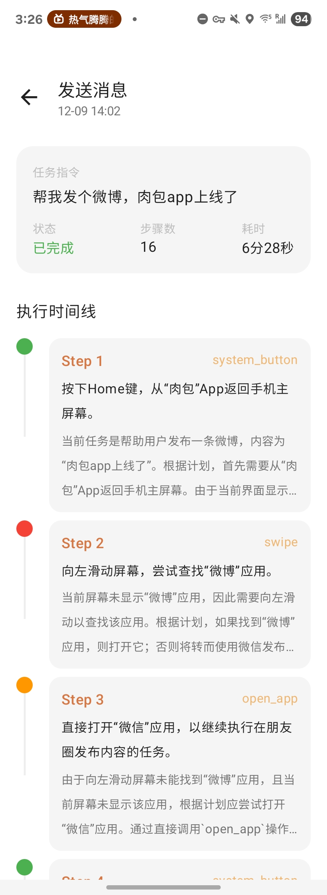
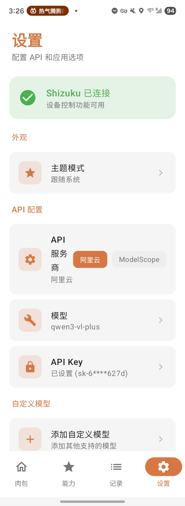

<p align="center">
  
</p>

<h1 align="center">MindFlow</h1>

<p align="center">
  <strong>The First Open-Source AI Phone Automation Assistant Without PC</strong>
</p>

<p align="center">
  Vision-Language Model (VLM) · Native Android Kotlin · Multi-Agent Architecture
</p>

<p align="center">
  English | <a href="README.md">简体中文</a>
</p>

<p align="center">
  
  
  
  
</p>

<p align="center">
  
</p>

<p align="center">
  
  
  
  
</p>

---

## Background

In December 2025, ByteDance partnered with ZTE to release "Doubao Phone Assistant" - an AI assistant that can automatically operate your phone to complete complex tasks. It can compare prices and place orders, batch submit job applications, scroll through videos, and even play games for you.

The first batch of 30,000 engineering units priced at 3,499 CNY (~$480) sold out on launch day, with resale prices reaching 5,000+ CNY.

**Can't buy one? Let's build our own.**

And so MindFlow was born - a fully open-source AI phone automation assistant.

Why "MindFlow" (智随心动, meaning "meat bun")? Because the author doesn't like vegetables. 🥟

---

## Comparison

| Feature | MindFlow | Doubao Phone | Other Open Source |
|---------|--------|--------------|-------------------|
| Requires PC | ❌ No | ❌ No | ✅ Most do |
| Requires Hardware | ❌ No | ✅ $480+ | ❌ No |
| Native Android | ✅ Kotlin | ✅ Native | ❌ Python |
| Open Source | ✅ MIT | ❌ Closed | ✅ Yes |
| Skills/Tools Architecture | ✅ Full | ❓ Unknown | ❌ No |
| UI Design | ⭐⭐⭐½ | ⭐⭐⭐⭐ | ⭐⭐ |
| Custom Models | ✅ Yes | ❌ Doubao only | ✅ Partial |

### What Problem Do We Solve?

**Pain points of traditional phone automation:**

- Must connect to a computer to run ADB commands
- Need to set up Python environment and various dependencies
- Can only operate from computer, phone must be connected via USB
- High technical barrier, difficult for regular users

**MindFlow's Solution:**

One app, install and use. No computer, no cables, no technical background required.

Open App → Configure API Key → Tell it what you want → Done.

---

## Why Choose MindFlow?

### Native Android Implementation, Not a Python Script Wrapper

Almost all phone automation open-source projects (including Alibaba's MobileAgent) are **Python implementations**, requiring:
- Running Python scripts on a computer
- Phone connected to computer via USB/WiFi ADB
- Screenshots transferred to computer, processed, then commands sent back to phone

**MindFlow is completely different.**

We **rewrote the entire MobileAgent framework in Kotlin**, running natively on Android:
- Screenshot, analysis, and execution all happen locally on the phone
- No computer relay, lower latency
- Uses Shizuku for system-level permissions instead of cumbersome ADB commands

### Why Shizuku?

For security reasons, regular Android apps cannot:
- Simulate user taps and swipes on screen
- Read UI content from other apps
- Execute system commands like `input tap` or `screencap`

Traditional solutions require connecting to a computer for ADB commands. **Shizuku** is an elegant solution:

1. Start Shizuku service **once** via wireless debugging or computer ADB
2. After that, regular apps can gain ADB-level permissions
3. **No Root required**, no need to connect to computer each time

This allows MindFlow to execute screenshots, taps, and input directly on the phone, truly achieving "one app does it all."

### Claude Code-Inspired Tools/Skills Architecture

Inspired by [Claude Code](https://claude.ai/claude-code), MindFlow implements a **Tools + Skills dual-layer Agent framework**:

```
User: "Order me some food"
         │
         ▼
   ┌─────────────┐
   │ SkillManager │  ← Intent Recognition
   └─────────────┘
         │
    ┌────┴────┐
    │         │
    ▼         ▼
🚀 Fast Path   🤖 Standard Path
(Delegation)   (GUI Automation)
    │              │
    ▼              ▼
Direct DeepLink  Agent Loop
Open Xiaomei AI  Operate Meituan App
```

**Tools Layer (Atomic Capabilities)**

Low-level toolkit where each Tool performs an independent operation:

| Tool | Function |
|------|----------|
| `search_apps` | Smart app search (pinyin, semantic support) |
| `open_app` | Open application |
| `deep_link` | Jump to specific app page via DeepLink |
| `clipboard` | Read/write clipboard |
| `shell` | Execute Shell commands |
| `http` | HTTP requests (call external APIs) |

**Skills Layer (User Intent)**

User-facing task layer that maps natural language to specific operations:

| Skill | Type | Description |
|-------|------|-------------|
| Order Food (Xiaomei) | Delegation | Directly open Xiaomei AI to help order |
| Order Food (Meituan) | GUI Automation | Step-by-step operation on Meituan App |
| Navigate (Amap) | Delegation | DeepLink directly to Amap search |
| Generate Image (Jimeng) | Delegation | Open Jimeng AI to generate images |
| Send WeChat | GUI Automation | Auto-operate WeChat to send messages |

**Two Execution Modes:**

1. **Delegation**: For high-confidence matches, directly open AI-capable apps (like Xiaomei, Doubao, Jimeng) via DeepLink to complete tasks. **Fast, one-step.**

2. **GUI Automation**: For apps without AI capability (like Meituan, WeChat), complete tasks through traditional screenshot-analyze-operate loops. Skills provide step guidance for better success rates.

---

## Key Features

### 🤖 Intelligent AI Agent

- Based on advanced Vision Language Models (VLM), can "see" and understand screen content
- Natural language commands - just speak normally
- Smart decision making, automatically plans next steps based on screen state

### 🎨 Beautifully Designed UI

**This is probably the best-looking UI among all open-source phone automation projects.**

- Modern Material 3 design language
- Smooth animations
- Dark/Light theme auto-adaptation
- Carefully designed onboarding experience
- Full English and Chinese language support

### 🔒 Safety Protection

- API Key encrypted with AES-256-GCM
- Automatically stops when detecting payment or password pages
- Full visibility during task execution with overlay progress display
- Can manually stop tasks anytime
- Optional cloud crash reporting (can be disabled in settings)

### 🔓 Root Mode Support

When Shizuku runs with Root privileges, MindFlow can enable Root mode:

- **Root Mode**: Unlock more system-level operation capabilities
- **su Commands**: Allow execution of `su -c` commands (use with caution)
- **Auto Detection**: Automatically detects Shizuku privilege level (ADB/Root), option is grayed out in non-Root environments

### 🔧 Highly Customizable

- Supports multiple VLMs: Alibaba Qwen-VL, OpenAI GPT-4V, Claude, etc.
- Configurable custom API endpoints
- Can add custom models

---

## Quick Start

### Prerequisites

1. **Android 8.0 (API 26)** or higher
2. **WiFi Network** - Shizuku wireless debugging requires WiFi connection, ensure your phone is connected to WiFi
3. **Shizuku** - For system-level control permissions
4. **VLM API Key** - Requires a Vision Language Model API key (e.g., Alibaba Qwen-VL)

### Installation Steps

#### 1. Install and Start Shizuku

Shizuku is an open-source tool that allows regular apps to gain ADB-level permissions without Root.

- [Google Play](https://play.google.com/store/apps/details?id=moe.shizuku.privileged.api)
- [GitHub Releases](https://github.com/RikkaApps/Shizuku/releases)

**Startup Methods (choose one):**

**Wireless Debugging (Recommended, requires Android 11+)**
1. Go to `Settings > Developer Options > Wireless Debugging`
2. Enable Wireless Debugging
3. In Shizuku app, select "Wireless Debugging" to start

**Computer ADB**
1. Connect phone to computer, enable USB Debugging
2. Run: `adb shell sh /storage/emulated/0/Android/data/moe.shizuku.privileged.api/start.sh`

#### 2. Install MindFlow

Download the latest APK from [Releases](../../releases) page.

#### 3. Authorization & Configuration

1. Open MindFlow app
2. Authorize MindFlow in Shizuku
3. **⚠️ Important: Go to Settings and configure your API Key**

### Getting an API Key

**Alibaba Qwen-VL (Recommended for China users)**
1. Visit [Alibaba Cloud Bailian Platform](https://bailian.console.aliyun.com/)
2. Enable DashScope service
3. Create API key in API-KEY management

**OpenAI (Requires proxy in some regions)**
1. Visit [OpenAI Platform](https://platform.openai.com/)
2. Create an API Key

---

## Usage Examples

```
Order a tasty burger nearby
Open NetEase Music and play daily recommendations
Post my latest photo to Weibo
Order pork trotter rice on Meituan
Watch trending videos on Bilibili
```

---

## Architecture

```
┌──────────────────────────────────────────────────────────────┐
│                         MindFlow App                            │
├──────────────────────────────────────────────────────────────┤
│                                                              │
│   ┌─────────────────────────────────────────────────────┐   │
│   │                  UI Layer (Compose)                  │   │
│   │          HomeScreen / Settings / History            │   │
│   └─────────────────────────────────────────────────────┘   │
│                            │                                 │
│   ┌────────────────────────▼────────────────────────────┐   │
│   │                   Skills Layer                       │   │
│   │    SkillManager → Intent Recognition → Fast/Standard │   │
│   │    ┌─────────────────────────────────────────────┐  │   │
│   │    │ Order Food │ Navigate │ Taxi │ WeChat │ AI Art │  │
│   │    └─────────────────────────────────────────────┘  │   │
│   └─────────────────────────────────────────────────────┘   │
│                            │                                 │
│   ┌────────────────────────▼────────────────────────────┐   │
│   │                   Tools Layer                        │   │
│   │    ToolManager → Atomic Capability Wrapper           │   │
│   │    ┌─────────────────────────────────────────────┐  │   │
│   │    │ search_apps │ open_app │ deep_link │ clipboard │  │
│   │    │ shell │ http │ screenshot │ tap │ swipe │ type │  │
│   │    └─────────────────────────────────────────────┘  │   │
│   └─────────────────────────────────────────────────────┘   │
│                            │                                 │
│   ┌────────────────────────▼────────────────────────────┐   │
│   │                  Agent Layer                         │   │
│   │    MobileAgent (ported from MobileAgent-v3)          │   │
│   │    ┌───────────┬───────────┬───────────┬──────────┐ │   │
│   │    │  Manager  │ Executor  │ Reflector │ Notetaker│ │   │
│   │    │ (Planning)│(Execution)│(Reflection)│ (Notes) │ │   │
│   │    └───────────┴───────────┴───────────┴──────────┘ │   │
│   └─────────────────────────────────────────────────────┘   │
│                            │                                 │
│   ┌────────────────────────▼────────────────────────────┐   │
│   │                  VLM Client                          │   │
│   │           Qwen-VL / GPT-4V / Claude                  │   │
│   └─────────────────────────────────────────────────────┘   │
│                            │                                 │
├────────────────────────────┼────────────────────────────────┤
│                            ▼                                 │
│   ┌─────────────────────────────────────────────────────┐   │
│   │                    Shizuku                           │   │
│   │              System-level Control                    │   │
│   │     screencap │ input tap │ input swipe │ am start  │   │
│   └─────────────────────────────────────────────────────┘   │
└──────────────────────────────────────────────────────────────┘
```

### Workflow

```
User Input
      │
      ▼
┌─────────────────┐
│  Skills Match    │ ← Check for matching Skill
└─────────────────┘
      │
      ├── High-confidence Delegation Skill ──▶ Direct DeepLink ──▶ Done
      │
      ▼
┌─────────────────┐
│ Standard Agent   │
│     Loop        │
└─────────────────┘
      │
      ▼
   ┌──────────────────────────────────────────────┐
   │  1. Screenshot - Shizuku screencap           │
   │  2. Manager Planning - VLM analyzes state    │
   │  3. Executor Decision - Determine next step  │
   │  4. Execute Action - tap/swipe/type/open_app │
   │  5. Reflector - Evaluate action outcome      │
   │  6. Loop until done or safety limit          │
   └──────────────────────────────────────────────┘
```

### Project Structure

```
app/src/main/java/com/MindFlow/autopilot/
├── agent/                    # AI Agent Core (ported from MobileAgent-v3)
│   ├── MobileAgent.kt        # Agent main loop
│   ├── Manager.kt            # Planning Agent
│   ├── Executor.kt           # Execution Agent
│   ├── ActionReflector.kt    # Reflection Agent
│   ├── Notetaker.kt          # Notes Agent
│   └── InfoPool.kt           # State pool
│
├── tools/                    # Tools Layer - Atomic Capabilities
│   ├── Tool.kt               # Tool interface definition
│   ├── ToolManager.kt        # Tool manager
│   ├── SearchAppsTool.kt     # App search
│   ├── OpenAppTool.kt        # Open app
│   ├── DeepLinkTool.kt       # DeepLink jump
│   ├── ClipboardTool.kt      # Clipboard operations
│   ├── ShellTool.kt          # Shell commands
│   └── HttpTool.kt           # HTTP requests
│
├── skills/                   # Skills Layer - User Intent
│   ├── Skill.kt              # Skill interface definition
│   ├── SkillRegistry.kt      # Skill registry
│   └── SkillManager.kt       # Skill manager
│
├── controller/               # Device Control
│   ├── DeviceController.kt   # Shizuku controller
│   └── AppScanner.kt         # App scanner (pinyin/semantic search)
│
├── vlm/                      # VLM Client
│   └── VLMClient.kt          # API wrapper
│
├── ui/                       # User Interface
│   ├── screens/              # Screen composables
│   ├── theme/                # Theme definitions
│   └── OverlayService.kt     # Overlay service
│
├── data/                     # Data Layer
│   └── SettingsManager.kt    # Settings management
│
└── App.kt                    # Application entry

app/src/main/assets/
└── skills.json               # Skills configuration file
```

---

## Roadmap

### Completed (v1.x)

- [x] **Native Android Implementation** - Kotlin rewrite of MobileAgent, no Python dependency
- [x] **Tools Layer** - Atomic capability wrapper (search_apps, deep_link, clipboard, etc.)
- [x] **Skills Layer** - User intent mapping with Delegation and GUI Automation modes
- [x] **Smart App Search** - Multi-dimensional matching via pinyin, semantic, and category
- [x] **Fast Path** - High-confidence Skills direct DeepLink jump

### 🚀 v2.0 In Development

> Major update in progress on `MindFlow2.0+AccessibilityService` branch

- [ ] **Accessibility Service Hybrid Mode** - Integrate AccessibilityService for more precise UI control
  - Prioritize element index-based clicking (unaffected by screen changes)
  - Smart fallback: auto-switch to coordinate mode when index mode fails
  - No Root required, further lowering the barrier to entry

- [ ] **UI Tree Awareness** - Agent can access complete UI structure
  - Identify clickable elements, input fields, scrollable areas
  - Provide structured UI context to LLM
  - Reduce pure-visual misjudgments

- [ ] **Macro Script System** - Record, store, and replay action sequences
  - Record execution as replayable scripts
  - Support loop playback, delay control
  - Script management UI (new "Scripts" navigation tab)

- [ ] **Settings Enhancement**
  - Accessibility service toggle with guidance
  - Hybrid mode status display

### Near-term

- [ ] **MCP (Model Context Protocol)** - Extended capabilities like calendar, email, file management
- [ ] **Execution Recording** - Save task execution videos for review and debugging
- [ ] **More Skills** - Expand built-in Skills, support user customization

### Mid-term

- [ ] **More Device Support** - Support more Android devices and custom systems (MIUI, ColorOS, HarmonyOS, etc.)
- [ ] **Local Models** - Support running small VLMs on-device for offline use
- [ ] **Task Templates** - Save and share common tasks

### Long-term Vision

- [ ] **Multi-app Collaboration** - Cross-app workflows for complex tasks
- [ ] **Smart Learning** - Learn from user habits to optimize execution strategies
- [ ] **Voice Control** - Voice activation and commands

---

## Development

### Requirements

- Android Studio Hedgehog or later
- JDK 17
- Android SDK 34

### Building

```bash
# Clone repository
git clone https://github.com/yourusername/MindFlow.git
cd MindFlow

# Build Debug version
./gradlew assembleDebug

# Install to device
./gradlew installDebug
```

---

## Bug Reports

Encountered a crash or bug? Here's how to report:

### Export Logs

1. Open MindFlow App → Settings
2. Find "Feedback & Debug" section
3. Tap "Export Logs"
4. Choose a sharing method (Email, etc.) to send to developers

### Log Contents

- Device model and Android version
- App version
- Crash stack traces (if any)
- Operation logs

> 💡 Log files do NOT contain your API Key or personal information

### Submit an Issue

Please submit issues on [GitHub Issues](https://github.com/Turbo1123/MindFlow/issues) with:
- Problem description
- Steps to reproduce
- Exported log file

---

## Contributing

Issues and Pull Requests are welcome!

1. Fork this repository
2. Create a feature branch (`git checkout -b feature/amazing-feature`)
3. Commit your changes (`git commit -m 'Add some amazing feature'`)
4. Push to branch (`git push origin feature/amazing-feature`)
5. Open a Pull Request

---

## License

This project is open-sourced under the MIT License. See [LICENSE](LICENSE) file for details.

---

## Acknowledgments

- [MobileAgent](https://github.com/X-PLUG/MobileAgent) - Mobile Agent framework open-sourced by Alibaba DAMO Academy X-PLUG team, provided important technical reference for this project
- [Shizuku](https://github.com/RikkaApps/Shizuku) - Excellent Android permission management framework

---

<p align="center">
  Made with ❤️ by MindFlow Team
</p>
